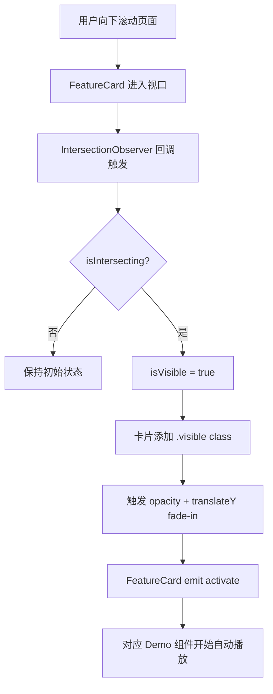
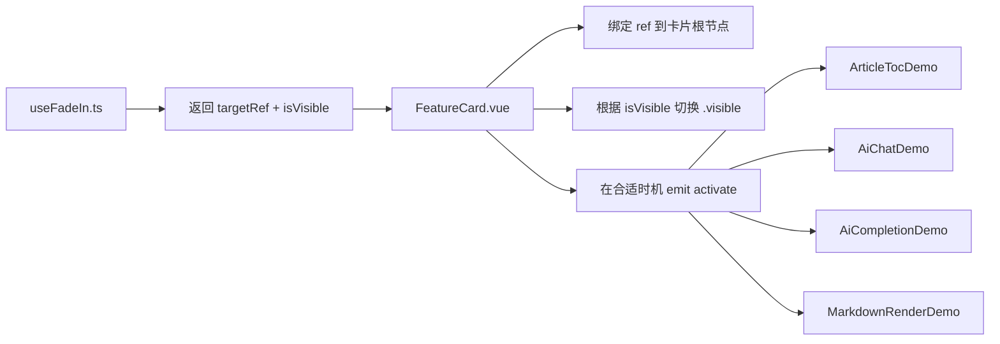

# 首页 Features 示例数据说明

这些 JSON 文件用于首页 `Features` 展示区的自动演示内容，全部都是前端本地模拟数据，不依赖后端接口。

## 文件说明

- `features.json`
  - 控制 4 张 feature 卡片的标题和描述文案。
- `article-toc-demo.json`
  - 控制“浏览文章自动目录划分”示例。
  - `sections` 里的每一项都会渲染成一个章节，并自动生成右侧目录。
- `ai-chat-demo.json`
  - 控制“AI 助手：文章总结”示例的对话脚本、打字速度和思考时长。
- `ai-completion-demo.json`
  - 控制“AI 助手：辅助编写提示”示例的编辑器初始文本、补全文案与选中项。
- `markdown-demo.json`
  - 控制“Markdown 实时渲染”示例里左侧逐步输入的 Markdown 内容。

## 如何自定义文章示例

`article-toc-demo.json` 的章节结构如下：

```json
{
  "title": "文章标题",
  "intro": "开头说明",
  "sections": [
    {
      "id": "section-id",
      "heading": "一、章节标题",
      "level": 1,
      "paragraphs": ["第一段", "第二段"],
      "image": {
        "src": "/feature-demo/article-cover.png",
        "alt": "图片说明"
      },
      "code": "const demo = true;"
    }
  ]
}
```

### 图片怎么放

推荐两种方式：

1. 放到前端项目的 `public/` 目录下。
2. 在 JSON 里使用以 `/` 开头的地址。

例如：

```json
{
  "src": "/feature-demo/article-cover.png",
  "alt": "文章配图"
}
```

这样浏览器会从 `public/feature-demo/article-cover.png` 读取图片。

你也可以直接填远程图片 URL。

## 文案与节奏怎么改

- 打字速度：`typingSpeed`
- AI 流式输出速度：`streamSpeed`
- 思考加载时长：`thinkingDelay` / `loadingDelay`
- 循环重播间隔：`loopDelay`

单位都是毫秒。

## 小提示

- `id` 尽量保持唯一，避免目录跳转混乱。
- 如果你把段落写得更长，文章目录示例的滚动空间会更明显。
- Markdown 示例支持标题、列表、引用、代码块等常见语法，建议保留至少一种代码块，这样右侧预览更有辨识度。

## 视口触发动画怎么实现

首页 Features 的进入动画分两步：

1. 用 `IntersectionObserver` 监听卡片是否进入视口。
2. 当元素进入视口后，给卡片加上 `.visible`，触发 `opacity + transform` 的过渡动画。

如果你还想像本项目一样，在 fade-in 结束后再启动内部 demo，可以在监听到可见后再触发一个 `emit('activate')`。

### Mermaid 逻辑链路图





### 可复用示例

```ts
import { onBeforeUnmount, ref, watch } from 'vue';

export function useFadeIn(options: IntersectionObserverInit = {}) {
  const { root = null, rootMargin = '0px', threshold = 0.2 } = options;
  const targetRef = ref<HTMLElement | null>(null);
  const isVisible = ref(false);
  let observer: IntersectionObserver | null = null;

  watch(
    targetRef,
    (element) => {
      observer?.disconnect();
      if (!element) return;

      observer = new IntersectionObserver(
        ([entry]) => {
          if (!entry) return;

          if (entry.isIntersecting) {
            isVisible.value = true;
            observer?.disconnect(); // 只触发一次
          }
        },
        { root, rootMargin, threshold },
      );

      observer.observe(element);
    },
    { flush: 'post' },
  );

  onBeforeUnmount(() => observer?.disconnect());

  return { targetRef, isVisible };
}
```

```vue
<template>
  <article ref="targetRef" class="feature-card" :class="{ visible: isVisible }">
    <slot />
  </article>
</template>

<script setup lang="ts">
import { useFadeIn } from '@/composables/useFadeIn';

const { targetRef, isVisible } = useFadeIn({
  threshold: 0.18,
});
</script>

<style scoped>
.feature-card {
  opacity: 0;
  transform: translateY(20px);
  transition:
    opacity 0.6s cubic-bezier(0.16, 1, 0.3, 1),
    transform 0.6s cubic-bezier(0.16, 1, 0.3, 1);
}

.feature-card.visible {
  opacity: 1;
  transform: translateY(0);
}
</style>
```

### 可调参数

- `threshold`：元素进入视口多少比例后触发，常用 `0.1 ~ 0.3`。
- `rootMargin`：提前或延后触发，例如 `0px 0px -10% 0px`。
- `once`：如果你想允许离开视口后再次播放，可以不要在触发后 `disconnect()`。
